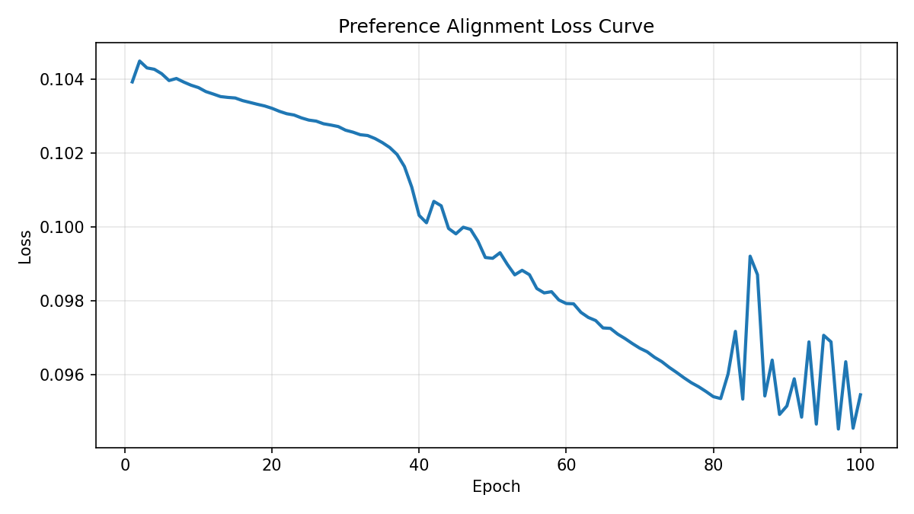

# MVP Summary: 基于人类偏好学习提取LLM风格向量

## 1. 对齐优化思路概述
在同一 Case 与同一目标作家下，对三种策略（A/B/C）按 human score 做两两比较，构建偏好对 $(h,l)$。
优化目标是让高分样本与作家风格质心更相似、低分样本更不相似。

损失函数：
$$
\mathcal{L}_{total} = \underbrace{\max(0, m - s_h + s_l)}_{\text{Margin Ranking Loss}} + \lambda \lVert w \rVert_1
$$
其中 $m=0.1$，$\lambda=0.005$，$w\in\mathbb{R}^{24}$ 为可学习层权重。

## 2. 整体指标变化
- 对齐前 Spearman 相关系数：**-0.1684**
- 对齐后 Spearman 相关系数：**-0.0986**
- 初始权重（[0,...,1]）：`[0.0, 0.0, 0.0, 0.0, 0.0, 0.0, 0.0, 0.0, 0.0, 0.0, 0.0, 0.0, 0.0, 0.0, 0.0, 0.0, 0.0, 0.0, 0.0, 0.0, 0.0, 0.0, 0.0, 1.0]`
- 优化后权重：`[0.000543, 0.000332, -0.129067, -0.002029, -0.00091, -8.4e-05, -0.002073, 0.001843, 0.000227, -0.005941, -0.005299, -0.001956, -0.002359, -0.005362, -0.001224, 0.030048, 0.026043, -0.001182, 0.000258, 0.003229, -0.014753, -0.015814, -0.006957, 0.118787]`

## 3. 损失函数下降图

## 4. Case 抽样细节展示
示例：**Case 1 转化为余华**

### 源文本 (Source Text)
小时候，我总爱黏着祖父，往巷口那家老茶馆跑。茶馆的门是褪了色的朱红色，推上去会发出 “吱呀” 一声轻响，像在跟人打招呼。堂屋里摆着七八张四方木桌，桌角都磨出了圆润的包浆，桌缝里嵌着经年累月的茶渍，看着却格外亲切。茶客们多是街坊邻里，有叼着旱烟袋的老爷子，吧嗒着烟圈聊昨夜的牌局；有挎着菜篮的阿婆，刚放下菜篮就凑过来问街坊谁家的孩子考了学。

 祖父总点一壶碧螺春，茶博士拎着长嘴铜壶，手腕一扬，沸水就划出一道银亮的弧线，精准落进茶碗里，茶叶在水中舒展，浮浮沉沉间飘出清冽的香。我蹲在桌角，盯着祖父桌上的芝麻烧饼，刚出炉的烧饼烤得金黄，表皮撒着一层白芝麻，咬一口酥掉渣，芝麻的香混着面香，在嘴里化开。

 茶馆的空气里永远混着茶香、烟味和烧饼的焦香，阳光从木格窗漏进来，在地上投下斑驳的影。那时的日子慢得像巷口的流水，没有作业的催促，没有大人的唠叨，只跟着祖父在茶馆里，听着人间烟火，啃着烧饼，把童年泡在这一方小小的市井烟火里，甜得发腻。

### 策略 B 的参考文本来源说明
采用静态 Few-shot：在目标作家语料中按 Stage/Location/Event 顺序做规则过滤，取 Top-3 作为参考。

- B-Ref1: 1960年4月3日的中午，我出生在杭州的一家医院里，可能是妇幼保健医院，当时我母亲在浙江医院，我父亲在浙江省防疫站工作。有关我出生时的情景，我的父母没有对我讲述过，在我记忆中他们总是忙忙碌碌，每天都有做不完的事，我几乎没有见过他们有空余的时间坐在一起谈谈过去，或者谈谈我——他们第二个儿子出生时的情景。...
- B-Ref2: 我的父亲在我一岁的时候，离开杭州来到一个叫海盐的县城，从而实现了他最大的愿望，成为了一名外科医生。我父亲一辈子只念过六年书，三年是小学，另外三年是大学，中间的课程是他在部队当卫生员时自学的，他在浙江医科大学专科毕业后，不想回到防疫站去，为了当一名外科医生，他先是到嘉兴，可是嘉兴方面让他去卫生学校当教务主任，所以他最后来到了一个更小的地方——海盐。...
- B-Ref3: 他给我母亲写了一封信，将海盐这个地方花言巧语了一番，于是我母亲放弃了在杭州的生活，带着我哥哥和我来到了海盐，我母亲经常用一句话来概括她初到海盐时的感受，她说：“连一辆自行车都看不到。”...

### 策略 C 具体召回的 Top-3 语料文本
使用级联召回（Strict -> Core -> Author Fallback）后，再按风格向量余弦相似度精排取 Top-3。

- C-Top1: 与我的很多同龄人不一样，我和我哥哥没有拉着祖辈们的衣角成长，而是在医院里到处乱窜，于是我喜欢上了病区走廊上的来苏儿的气味，而且学会了用酒精棉球擦洗自己的手。我经常看到父亲手术服上沾满血迹地走过来，对我看上一眼，又匆匆走去，繁忙的工作都使他不愿意站住脚和我说上一两句话。...
- C-Top2: 当我在明亮的灯光下喝着滚烫的鸡汤时，外面的寒风正在割着我的皮肤。我体会到了什么叫做幸福，幸福就是像我现在这样，身上穿暖和一些，胃里吃暖一些，活着就是如此简单。...
- C-Top3: 夏天的傍晚，我父亲和他的同事们有时会坐在桥栏上聊天。那是一座有人走过来就会微微晃动的木桥，我看着父亲的身体也在晃动，这情景曾经让我胆战心惊，不过夏季时晚霞让河水泛红的景色至今令我难忘。我记得自己经常站在那里，双手抓住桥栏看着下面流动的河水，我在河水里看到了天空如何从明亮走向黑暗的历程。...

### 策略 A/B/C 各自的 Mock/计算 BERTScore 和 Human Score
- 策略A: BERTScore=0.8884, HumanScore=5.112
- 策略B: BERTScore=0.9160, HumanScore=6.390
- 策略C: BERTScore=0.8763, HumanScore=6.789

### 策略 A/B/C 调优前后的风格余弦相似度变化
- 策略A: pre=0.8647 -> post=0.6986（降低）
- 策略B: pre=0.8630 -> post=0.7002（降低）
- 策略C: pre=0.8707 -> post=0.7242（降低）

---
- 生成样本总数：30（5 * 2 * 3）
- 语料规模统计：余华=73, 汪曾祺=74
- corpus_features 形状：{'余华': (73, 24, 1024), '汪曾祺': (74, 24, 1024)}
- gen_features 形状：(30, 24, 1024)