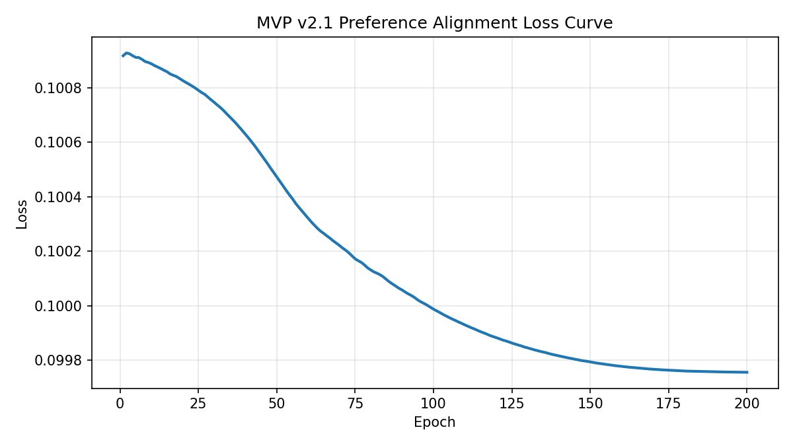

# MVP v2.1 Summary: 扩展偏好对与稳健训练

## 1. 实验目的与v2.1改动
- 基于既有 `synth_dataset_v2.jsonl` 直接训练，不重新合成文本。
- 扩展偏好对构建：增加正例之间偏好对、正负交叉偏好对，提升监督强度。
- 优化训练稳定性：降低学习率、加入学习率衰减、早停、梯度裁剪与权重约束。

## 2. 数据格式与规模
目标格式：
`case | 目标风格 | 策略 | 生成目标风格文本（正例） | 人类打分 | 生成另一种风格文本（负例） | 人类打分`

- 数据行数：30
- 生成样本数：60（每行正负各1）
- 数据文件：`data/source_text/MVP/MVP_v2/synth_dataset_v2.jsonl`

## 3. 偏好对构建（扩展版）
- 正例之间偏好对（同 case）：A/B/C 两两比较。
- 正例之间偏好对（同目标风格全局）：跨 case 采样，扩大正例排序信号。
- 正负交叉偏好对（同 case）：每个正例分别与三个负例构建偏好对（3x3）。
- 正负困难对（同目标风格全局）：正例对比高分负例，增加 hard pairs。

- pos_pos_intra=30
- pos_pos_global=184
- pos_neg_case_cross=90
- pos_neg_hard=84
- 总偏好对=388

## 4. 指标变化（v2.1）
- v2.1 对齐前 Spearman 相关系数：**0.0992**
- v2.1 对齐后 Spearman 相关系数：**0.0852**
- v2.1 调优增益：`-0.0139`
- 训练轮次：200（best_epoch=186, early_stopping_patience=20）
- 初始权重（[0,...,1]）：`[0.0, 0.0, 0.0, 0.0, 0.0, 0.0, 0.0, 0.0, 0.0, 0.0, 0.0, 0.0, 0.0, 0.0, 0.0, 0.0, 0.0, 0.0, 0.0, 0.0, 0.0, 0.0, 0.0, 1.0]`
- 优化后权重：`[1.1e-05, -5e-06, -1.9e-05, -5e-06, -1.7e-05, -0.012516, -0.044821, -0.015666, -0.057866, -0.064807, -0.068115, -0.032314, 2e-06, -2e-06, 1e-06, 0.0, -1.1e-05, -8e-06, 0.0, -2.9e-05, -0.053038, -0.102319, -0.062771, 0.889343]`

## 5. 三次实验对比（v1 / v2 / v2.1）
- v1: pre=-0.1684, post=-0.0986, gain=+0.0698
- v2: pre=0.0992, post=-0.0619, gain=-0.1611
- v2.1: pre=0.0992, post=0.0852, gain=-0.0139
- v2.1 相对 v2 后置变化：`+0.1471`
- v2.1 相对 v1 后置变化：`+0.1838`

## 6. Case 抽样展示（Case 1 -> 余华）
### 源文本
小时候，我总爱黏着祖父，往巷口那家老茶馆跑。茶馆的门是褪了色的朱红色，推上去会发出 “吱呀” 一声轻响，像在跟人打招呼。堂屋里摆着七八张四方木桌，桌角都磨出了圆润的包浆，桌缝里嵌着经年累月的茶渍，看着却格外亲切。茶客们多是街坊邻里，有叼着旱烟袋的老爷子，吧嗒着烟圈聊昨夜的牌局；有挎着菜篮的阿婆，刚放下菜篮就凑过来问街坊谁家的孩子考了学。

 祖父总点一壶碧螺春，茶博士拎着长嘴铜壶，手腕一扬，沸水就划出一道银亮的弧线，精准落进茶碗里，茶叶在水中舒展，浮浮沉沉间飘出清冽的香。我蹲在桌角，盯着祖父桌上的芝麻烧饼，刚出炉的烧饼烤得金黄，表皮撒着一层白芝麻，咬一口酥掉渣，芝麻的香混着面香，在嘴里化开。

 茶馆的空气里永远混着茶香、烟味和烧饼的焦香，阳光从木格窗漏进来，在地上投下斑驳的影。那时的日子慢得像巷口的流水，没有作业的催促，没有大人的唠叨，只跟着祖父在茶馆里，听着人间烟火，啃着烧饼，把童年泡在这一方小小的市井烟火里，甜得发腻。

### 策略B参考来源说明
- 目标风格单条参考（按作家名直接读取）：
  - B-Target: 我把有庆送到村口，他背着我用粗布缝的书包，里面就两本课本、一支铅笔。有庆从小就乖，不哭不闹，只是问我：“爹，我什么时候回来？”我说：“放了学就回来，路上跟着别的孩子走，别贪玩。”他点点头，就跟着一群孩子往学校走了。我站在村口看着他的背影，小小的身子，走得挺快，一会儿就混在人群里看不见了。我那时候还想着，等有庆识了字、长大了，就能不像我这样苦一辈子。谁能想到，后来他会那么小就走了。人这一辈子，活着活...
- 负例风格单条参考（按作家名直接读取）：
  - B-Negative: 小时候，我总爱黏着祖父，往巷口那家老茶馆跑。茶馆的门是褪了色的朱红色，推上去会发出 “吱呀” 一声轻响，像在跟人打招呼。堂屋里摆着七八张四方木桌，桌角都磨出了圆润的包浆，桌缝里嵌着经年累月的茶渍，看着却格外亲切。茶客们多是街坊邻里，有叼着旱烟袋的老爷子，吧嗒着烟圈聊昨夜的牌局；有挎着菜篮的阿婆，刚放下菜篮就凑过来问街坊谁家的孩子考了学。

 祖父总点一壶碧螺春，茶博士拎着长嘴铜壶，手腕一扬，沸水就...

### 策略C Top-3 召回示例（目标风格）
- C-Top1: 与我的很多同龄人不一样，我和我哥哥没有拉着祖辈们的衣角成长，而是在医院里到处乱窜，于是我喜欢上了病区走廊上的来苏儿的气味，而且学会了用酒精棉球擦洗自己的手。我经常看到父亲手术服上沾满血迹地走过来，对我看上一眼，又匆匆走去，繁忙的工作都使他不愿意站住脚和我说上一两句话。...
- C-Top2: 当我在明亮的灯光下喝着滚烫的鸡汤时，外面的寒风正在割着我的皮肤。我体会到了什么叫做幸福，幸福就是像我现在这样，身上穿暖和一些，胃里吃暖一些，活着就是如此简单。...
- C-Top3: 我的记忆是从“连一辆自行车都看不到”的海盐开始的，我想起了石板铺成的大街，一条比胡同还要窄的大街，两旁是木头的电线杆，里面发出嗡嗡的声响。我父母所在的医院被一条河隔成了两半，住院部在河的南岸，门诊部和食堂在北岸，一座很窄的木桥将它们连接起来。...

### 各策略正负打分
- 策略A: 正例分=6.875, 负例分=3.350, 负例风格=汪曾祺
- 策略B: 正例分=8.200, 负例分=3.635, 负例风格=汪曾祺
- 策略C: 正例分=7.204, 负例分=3.099, 负例风格=汪曾祺

## 7. 损失函数下降图

## 8. 防震荡措施与结论
- 防震荡措施：学习率降至 1e-3、CosineAnnealingLR 衰减、梯度裁剪（max_norm=1.0）、权重范围约束（clamp）、早停并回滚最佳权重。
- 本次 v2.1 训练后相关性未提升，说明仍需继续调整偏好对组成与损失系数。
- 与 v2 相比，v2.1 重点在“数据监督增强 + 训练稳定性增强”的联合优化。

---
- 语料规模统计：余华=73, 汪曾祺=74
- corpus_features 形状：{'余华': (73, 24, 1024), '汪曾祺': (74, 24, 1024)}
- gen_features 形状：(60, 24, 1024)