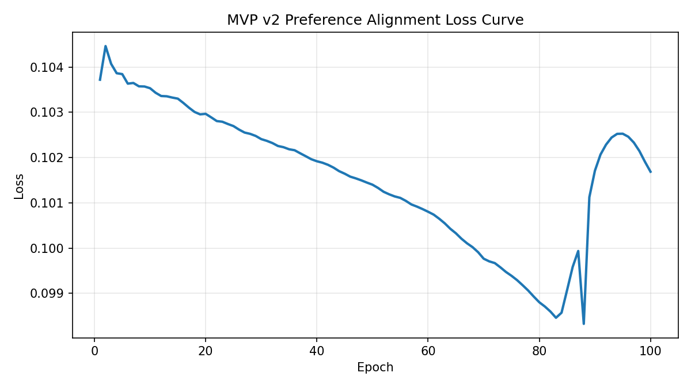

# MVP v2 Summary: 正负例混合偏好学习

## 1. 实验目的与v2改动
- 在保持两位目标风格（余华、汪曾祺）与三种策略（A/B/C）的前提下，重新合成正负例数据。
- 每行数据同时包含：目标风格正例文本与另一风格负例文本。
- 人类评分规则：正例随机 6~9，负例随机 2~4。
- 策略B改为按作家名直接读取单条参考文本：`data/source_text/data_to_generate/context_eng_references.json`。
- 策略C保留级联召回 + 风格向量精排（Top-3），再使用同一生成器生成。

## 2. 数据合成格式与规模
目标格式：
`case | 目标风格 | 策略 | 生成目标风格文本（正例） | 人类打分 | 生成另一种风格文本（负例） | 人类打分`

- 合成行数：30（5 * 2 * 3）
- 生成文本总数：60（每行正负各1条）
- 数据文件：`data/source_text/MVP/MVP_v2/synth_dataset_v2.jsonl`

## 3. 偏好对构建（含两类）
- 正例之间偏好对（pos-pos）：在同一 case+目标风格下，对 A/B/C 正例按分数做两两比较。
- 正负之间偏好对（pos-neg）：每一行使用 `(正例 > 负例)` 构建偏好对。
- 训练比例：pos-pos : pos-neg = 20 : 30
- 该比例用于同时保留细粒度策略排序能力和强区分的正负对齐信号。

## 4. 指标变化（v2）
- v2 对齐前 Spearman：**0.0992**
- v2 对齐后 Spearman：**-0.0619**
- 初始权重（[0,...,1]）：`[0.0, 0.0, 0.0, 0.0, 0.0, 0.0, 0.0, 0.0, 0.0, 0.0, 0.0, 0.0, 0.0, 0.0, 0.0, 0.0, 0.0, 0.0, 0.0, 0.0, 0.0, 0.0, 0.0, 1.0]`
- 优化后权重：`[0.002305, -0.004751, -0.011413, -0.00749, -0.010408, -0.014728, -0.017757, -0.005447, -0.021961, -0.032415, -0.067025, -0.024933, -0.004001, -0.00184, 0.001927, -0.001455, 0.004132, 0.002005, -0.008971, -0.007498, -0.013626, -0.023438, 0.003299, -0.009078]`

## 5. 与第一次MVP实验对比
- v1 对齐前 Spearman：**-0.1684**
- v1 对齐后 Spearman：**-0.0986**
- v2 相对 v1 的前置变化：`+0.2676`
- v2 相对 v1 的后置变化：`+0.0367`
- v1 调优增益：`+0.0698`
- v2 调优增益：`-0.1610`

## 6. Case 抽样展示（Case 1 -> 余华）
### 源文本
小时候，我总爱黏着祖父，往巷口那家老茶馆跑。茶馆的门是褪了色的朱红色，推上去会发出 “吱呀” 一声轻响，像在跟人打招呼。堂屋里摆着七八张四方木桌，桌角都磨出了圆润的包浆，桌缝里嵌着经年累月的茶渍，看着却格外亲切。茶客们多是街坊邻里，有叼着旱烟袋的老爷子，吧嗒着烟圈聊昨夜的牌局；有挎着菜篮的阿婆，刚放下菜篮就凑过来问街坊谁家的孩子考了学。

 祖父总点一壶碧螺春，茶博士拎着长嘴铜壶，手腕一扬，沸水就划出一道银亮的弧线，精准落进茶碗里，茶叶在水中舒展，浮浮沉沉间飘出清冽的香。我蹲在桌角，盯着祖父桌上的芝麻烧饼，刚出炉的烧饼烤得金黄，表皮撒着一层白芝麻，咬一口酥掉渣，芝麻的香混着面香，在嘴里化开。

 茶馆的空气里永远混着茶香、烟味和烧饼的焦香，阳光从木格窗漏进来，在地上投下斑驳的影。那时的日子慢得像巷口的流水，没有作业的催促，没有大人的唠叨，只跟着祖父在茶馆里，听着人间烟火，啃着烧饼，把童年泡在这一方小小的市井烟火里，甜得发腻。

### 策略B参考来源说明
- 目标风格参考（单条）来自 `context_eng_references.json`：
  - B-Target: 我把有庆送到村口，他背着我用粗布缝的书包，里面就两本课本、一支铅笔。有庆从小就乖，不哭不闹，只是问我：“爹，我什么时候回来？”我说：“放了学就回来，路上跟着别的孩子走，别贪玩。”他点点头，就跟着一群孩子往学校走了。我站在村口看着他的背影，小小的身子，走得挺快，一会儿就混在人群里看不见了。我那时候还想着，等有庆识了字、长大了，就能不像我这样苦一辈子。谁能想到，...
- 负例风格参考（单条）来自 `context_eng_references.json`：
  - B-Negative: 小时候，我总爱黏着祖父，往巷口那家老茶馆跑。茶馆的门是褪了色的朱红色，推上去会发出 “吱呀” 一声轻响，像在跟人打招呼。堂屋里摆着七八张四方木桌，桌角都磨出了圆润的包浆，桌缝里嵌着经年累月的茶渍，看着却格外亲切。茶客们多是街坊邻里，有叼着旱烟袋的老爷子，吧嗒着烟圈聊昨夜的牌局；有挎着菜篮的阿婆，刚放下菜篮就凑过来问街坊谁家的孩子考了学。

 祖父总点一壶碧螺...

### 策略C Top-3 召回示例（目标风格）
- C-Top1: 与我的很多同龄人不一样，我和我哥哥没有拉着祖辈们的衣角成长，而是在医院里到处乱窜，于是我喜欢上了病区走廊上的来苏儿的气味，而且学会了用酒精棉球擦洗自己的手。我经常看到父亲手术服上沾满血迹地走过来，对我看上一眼，又匆匆走去，繁忙的工作都使他不愿意站住脚和我说上一两句话。...
- C-Top2: 当我在明亮的灯光下喝着滚烫的鸡汤时，外面的寒风正在割着我的皮肤。我体会到了什么叫做幸福，幸福就是像我现在这样，身上穿暖和一些，胃里吃暖一些，活着就是如此简单。...
- C-Top3: 夏天的傍晚，我父亲和他的同事们有时会坐在桥栏上聊天。那是一座有人走过来就会微微晃动的木桥，我看着父亲的身体也在晃动，这情景曾经让我胆战心惊，不过夏季时晚霞让河水泛红的景色至今令我难忘。我记得自己经常站在那里，双手抓住桥栏看着下面流动的河水，我在河水里看到了天空如何从明亮走向黑暗的历程。...

### 各策略正负打分
- 策略A: 正例分=6.875, 负例分=3.350, 负例风格=汪曾祺
- 策略B: 正例分=8.200, 负例分=3.635, 负例风格=汪曾祺
- 策略C: 正例分=7.204, 负例分=3.099, 负例风格=汪曾祺

## 7. 训练曲线

## 8. 结论
- 仅用正例（v1）时，分数排序信号较弱且易受噪声影响。
- 本次 v2 在训练后相关性下降（0.0992 -> -0.0619），说明当前偏好对比例/损失权重仍需调参，正负混合信号尚未稳定转化为更好的全局排序。
- 保留一部分正例之间偏好对可维持策略细粒度排序，避免模型只学习“区分好坏”而丢失“好中更好”。

---
- 语料规模统计：余华=73, 汪曾祺=74
- corpus_features 形状：{'余华': (73, 24, 1024), '汪曾祺': (74, 24, 1024)}
- gen_features 形状：(60, 24, 1024)